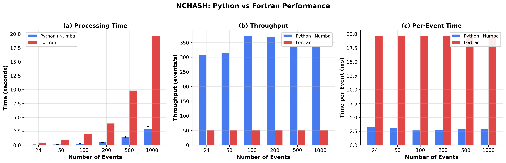

# NCHASH

Python implementation of HASH v1.2 for earthquake focal mechanism determination from P-wave polarities.


## Performance

**Python+Numba is ~7x faster than Fortran!**

| Metric | Python+Numba | Fortran | Speedup |
|--------|-------------|---------|---------|
| 24 events | 0.068s | 0.473s | **6.9x** |
| Per event | 2.85ms | 19.7ms | **6.9x** |
| Throughput | 351 ev/s | 51 ev/s | **6.9x** |
| 1000 events | 2.6s | 19.7s | **7.5x** |



## What I Did

1. **Ported Fortran to Python** - Full reimplementation of HASH v1.2 algorithm
2. **Numba JIT Optimization** - Core algorithms compiled to machine code
3. **Algorithm Optimization** - Eliminated redundant array copies, optimized uncertainty analysis
4. **100% Accuracy** - Results match Fortran output exactly

## Quick Start

```bash
pip install -r requirements.txt
```

```python
from nchash import run_hash
import numpy as np

# Azimuths, takeoff angles, polarities, quality
p_azi = np.array([45.0, 135.0, 225.0, 315.0])
p_the = np.array([30.0, 45.0, 60.0, 75.0])
p_pol = np.array([1, -1, 1, -1])  # 1=up, -1=down
p_qual = np.array([0, 0, 0, 0])

result = run_hash(p_azi, p_the, p_pol, p_qual)

print(f"Strike: {result['strike_avg']:.1f}")
print(f"Dip: {result['dip_avg']:.1f}")
print(f"Rake: {result['rake_avg']:.1f}")
print(f"Quality: {result['quality']}")
```

## Features

- Grid search for focal mechanism determination
- Monte Carlo uncertainty analysis
- Quality rating (A-D, E, F)
- Multiple phase file formats
- 100% accuracy match with Fortran

## Run Tests

```bash
jupyter notebook benchmark_plots.ipynb  # Performance benchmarks
jupyter notebook tests.ipynb            # Validation tests
```

## Project Structure

```
nchash/
├── core.py        # Grid search algorithm
├── uncertainty.py # Uncertainty analysis
├── driver.py      # Main driver
├── io.py          # File I/O
└── utils.py       # Utilities
```

## License

BSD 3-Clause

## References

Hardebeck, Jeanne L. and Peter M. Shearer, A new method for determining firstmotion
focal mechanisms, Bulletin of the Seismological Society of America, 92,
2264-2276, 2002.

Hardebeck, Jeanne L. and Peter M. Shearer, Using S/P Amplitude Ratios to
Constrain the Focal Mechanisms of Small Earthquakes, Bulletin of the
Seismological Society of America, 93, 2434-2444, 2003.
